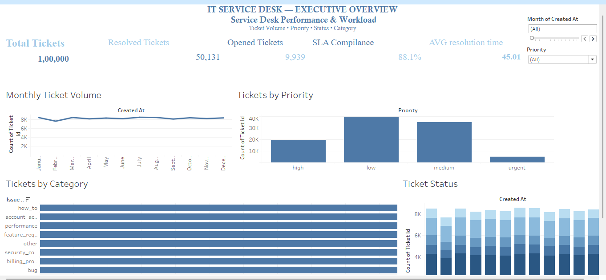
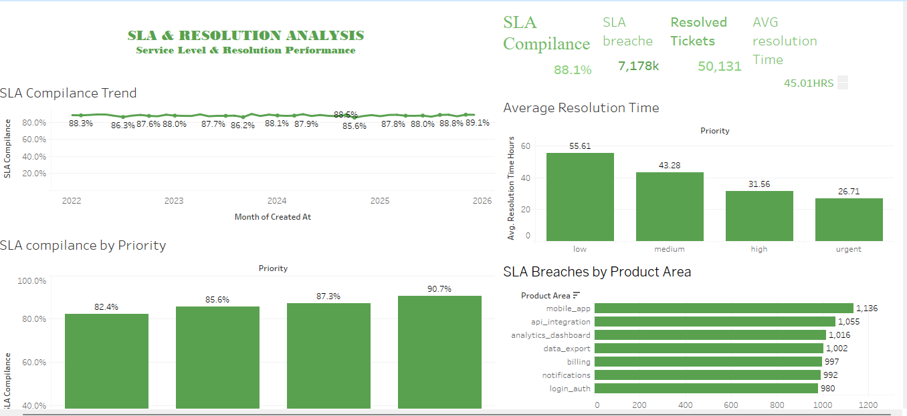
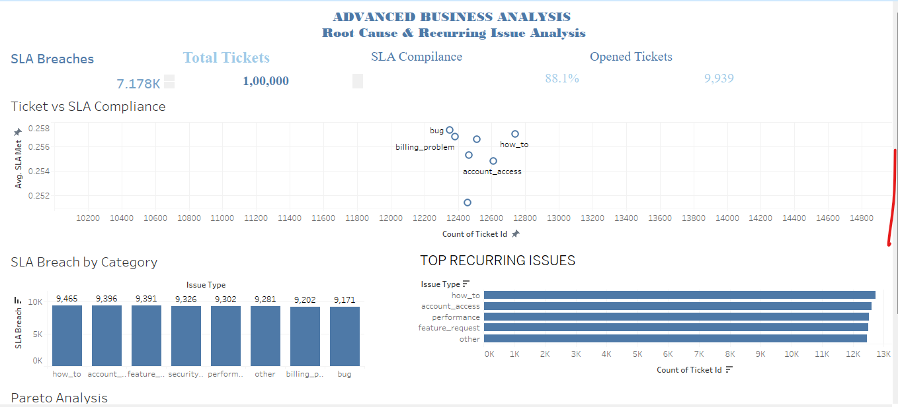

# IT Service Desk & SLA Analytics

## Project Overview

This project analyzes IT service desk ticket data to understand service workload, SLA performance, resolution efficiency, and recurring issues.

The project was developed using Tableau with 3 interactive dashboards.

## Tools Used

- Tableau
- Excel / CSV
- Data Visualization
- Calculated Fields
- Dashboard Design
- Business Analysis

## Dashboards

### 1. IT Service Desk — Executive Overview

Focuses on overall service desk performance and workload.

Key analysis:
- Monthly Ticket Volume
- Tickets by Priority
- Tickets by Category
- Ticket Status / Backlog

### 2. SLA & Resolution Analysis

Focuses on SLA performance and ticket resolution.

Key analysis:
- SLA Compliance by Priority
- SLA Compliance Trend
- SLA Breaches
- Average Resolution Time

### 3. Advanced Business Analysis

Focuses on identifying patterns and areas requiring attention.

Key analysis:
- Tickets vs SLA Compliance
- SLA Breaches by Category
- Top Recurring Issues
- Pareto Analysis

## Tableau Workbook

The complete Tableau packaged workbook is available in this repository:

`IT_Service_Desk_SLA_Analytics.twbx`

## Skills Demonstrated

- Data Analysis
- Data Visualization
- Tableau Dashboard Development
- KPI Creation
- Calculated Fields
- SLA Analysis
- Business Insights
